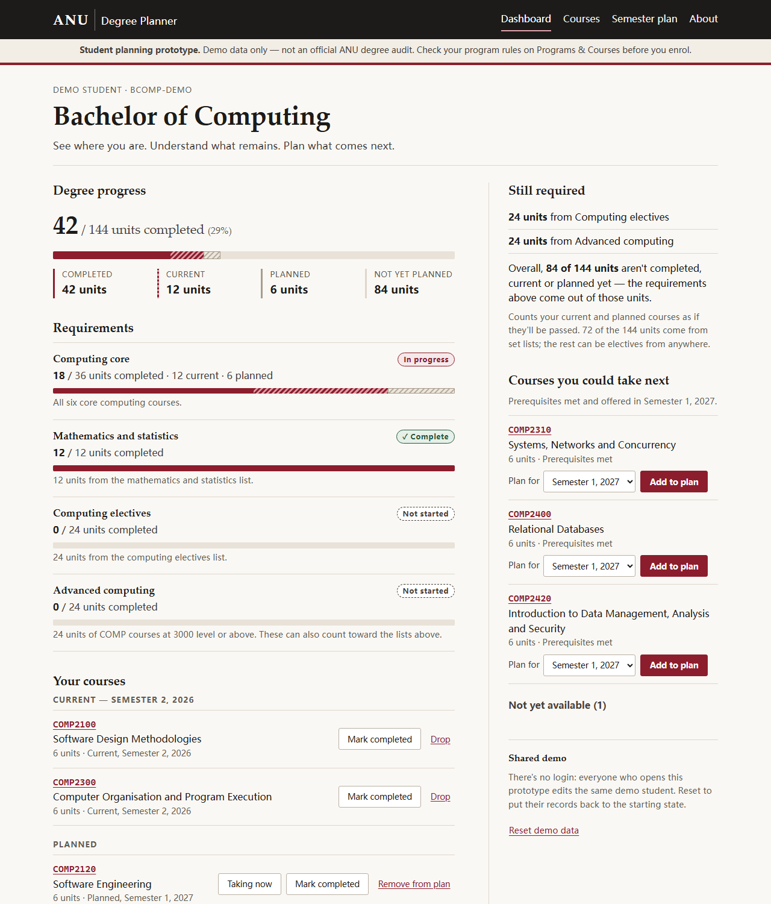

# ANU Degree Planner

ANU Degree Planner is a prototype full-stack student planning system: one
page that shows a student how much of their degree is done, which
requirements are still open, and which courses they could take next, and
lets them record courses as completed, current or planned. Every change
goes to a SQLite database on the server and is still there after a reload.
It's the ANU system I wish existed, built as a small vertical slice for
COMP4020 crit 7.



**This is not an official ANU degree audit.** It models one demo student in
one simplified demo degree. Course codes and titles follow ANU's; the
prerequisites, semester offerings and degree rules are simplified for the
prototype. Programs & Courses is the source of truth.

## The problem

ANU students can look up any single course or degree rule, but nothing puts
the pieces together. To answer "how far through am I, what do I still need,
and what should I take next semester?" you read the degree's requirements
on Programs & Courses, check your academic record, look up each candidate
course's prerequisites one page at a time, and do the arithmetic yourself.
The planner does that arithmetic from your records and keeps your plan.

## The core workflow

1. Open the dashboard: units completed out of 144, progress on each
   requirement, what's still required, and courses you could take next.
2. Pick a course — from the dashboard's suggestions or the course
   catalogue — and add it to your plan for an upcoming semester (or mark it
   current, or completed).
3. The browser submits a plain HTML form to the server; the server writes
   the change to SQLite and redirects back.
4. The page re-renders from the database: the course is in your plan, and
   the progress bars, requirement states and suggestions have recalculated.
5. Reload — or restart the server — and the change is still there.

Pages:

- **Dashboard** (`/`) — degree progress, requirements, your courses, still
  required, courses you could take next.
- **Courses** (`/courses/`) — the demo catalogue, with search and filters by
  level, semester and your standing (prerequisites met, missing, planned,
  current, completed); each course has its own page with its
  prerequisites, what it leads to, and which requirements it counts toward.
- **Semester plan** (`/plan/`) — planned courses semester by semester, with
  unit totals, a flag for loads above 24 units, and warnings when a
  prerequisite is planned too late or a course is planned in a semester it
  doesn't run in.

## What good looks like here

A student should understand where they stand within seconds of opening the
dashboard, and be able to make at least one meaningful planning change that
persists in the database. Concretely, I held the work to these:

**The database is the only source of truth.** The schema
(`src/lib/schema.ts`) has eight relational tables — degrees, courses, course
offerings, prerequisites, degree requirements and their course lists,
students and the student's course records — built by committed Drizzle
migrations with foreign keys and CHECK constraints. Nothing the pages show
is stored as a derived value or typed into a page: units completed, units
remaining, requirement progress, percentages, a course's level and whether
it's eligible are all computed from rows on each request, in one pure module
(`src/lib/planner.ts`).

**Real persistence, no client-side state.** Every change is an HTML form
POST followed by a redirect, so the app works with JavaScript off, and a
reload always shows what's in SQLite. The only client script listens on a
server-sent-events stream and offers a reload when the records change in
another tab.

**Honest about what it isn't.** Every page carries the prototype notice.
Planning warnings are information, not enforcement. The demo data is small
on purpose: nineteen courses, four requirements, direct prerequisites only.

**Accessible by construction.** One heading per page, labelled controls,
buttons that name their course for screen readers, visible focus, and no
information carried by colour alone: every bar has the same numbers beside
it in text, and every status has words.

What's enforced, and what's judgement:

- *Enforced by tests* (`spec/`, run by `pnpm check`): a planned course is
  still planned after a reload; completing a course recalculates units and
  requirement progress; courses with unmet prerequisites aren't suggested;
  catalogue filters, plan warnings, bad input, cross-site POSTs and the SSE
  broadcast behave; the derivations are right on hand-built edge cases; and
  every page passes the axe accessibility floor and the course's structural
  invariants.
- *Enforced by the harness* (`CLAUDE.md`): the rules above, as instructions
  the coding agent works under.
- *Judgement*: whether the dashboard really answers "where am I?" at a
  glance, the visual design, and colour contrast (which the automated axe
  run can't check without a real browser).

What I chose not to build: logins, real ANU data or integration with ANUHub,
Canvas or Programs & Courses, the full prerequisite grammar (or-groups,
co-requisites, incompatibilities, unit thresholds), recommendations beyond
"prerequisites met and offered next semester", and drag-and-drop planning.
A small complete product beat a large incomplete one.

## Prototype limitations

- **One shared demo student.** There's no login, so everyone who opens the
  deployed prototype edits the same records. The dashboard has a "Reset
  demo data" button that restores the starting state.
- **One demo degree, simplified.** The Bachelor of Computing here is shaped
  like an ANU computing degree but its rules are invented for the demo. A
  course can count toward more than one requirement (a 3000-level elective
  counts toward both the electives list and the advanced-computing
  requirement), which is how level requirements overlap in real degree
  rules, but real rules have much more to them.
- **Direct prerequisites only**, and a current course counts as meeting a
  prerequisite for next semester.
- **The current semester is fixed** at Semester 2, 2026, so the demo data
  stays coherent.

## Running it

```sh
pnpm install          # on a machine without make: pnpm install --ignore-scripts
pnpm dev              # http://localhost:4321
pnpm check            # typecheck, build, and the whole spec against the built server
```

The database is `.data/app.db` locally and `/data/app.db` on the Fly
volume. Migrations in `drizzle/` apply when the server boots, and the demo
data is inserted into an empty database; there's no separate setup step.
To change the schema: edit `src/lib/schema.ts`, run `pnpm db:generate`, and
commit the migration it writes.
